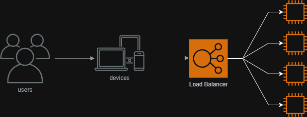
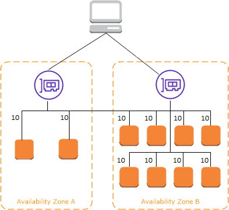
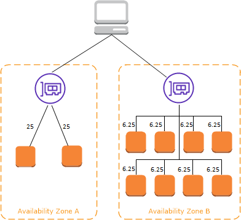
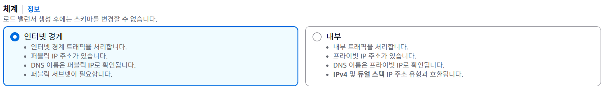
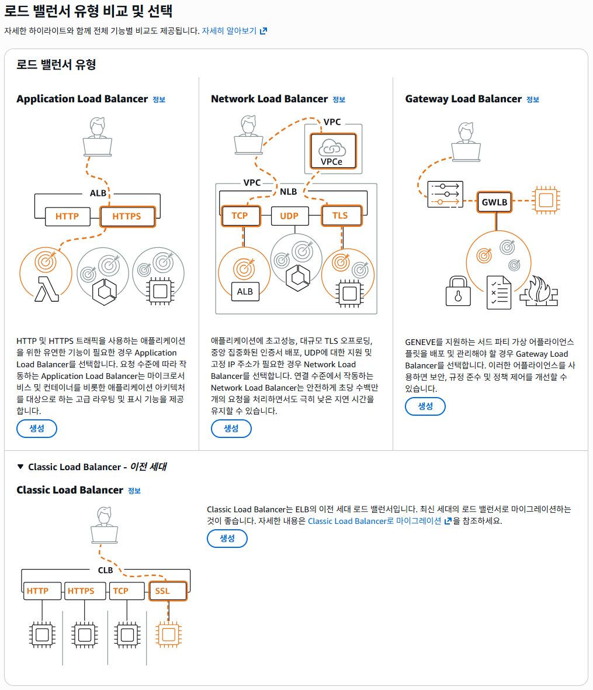
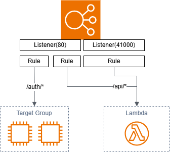
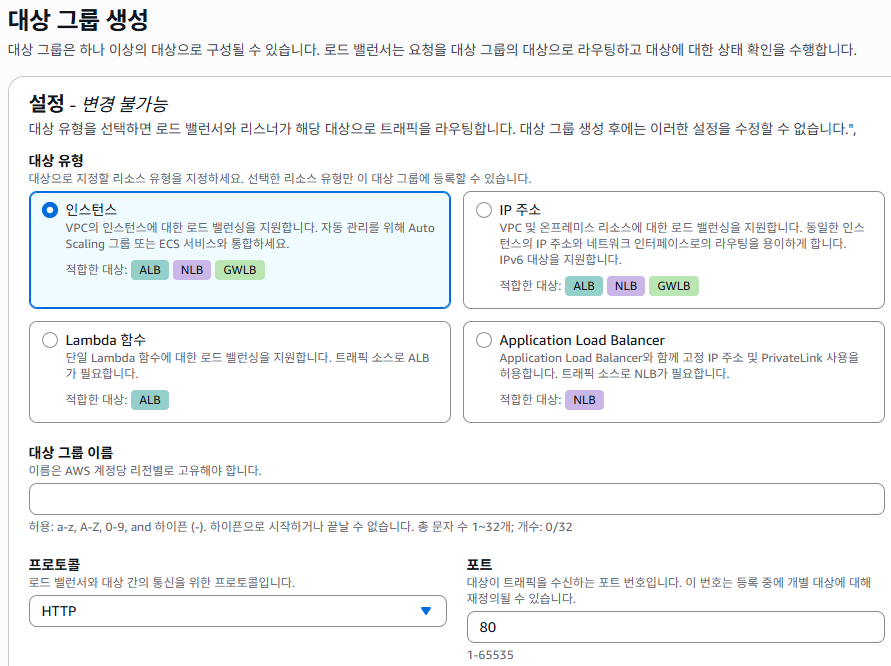

# ELB (Elastic Load Balancer) 이란

수신되는 여러 트레픽을 IP, 인스턴스, Lambda, 또다른 Application Load Balancer 로 분산하는 시스템입니다. 로드 밸런서는 클라이언트에서 오는 트래픽을 하나 이상의 가용영역에 등록된 대상으로 라우팅합니다.

- 헬스 체크를 통해 풀 내 비정상 인스턴스를 감지하고 비정상 인스턴스가 복원될 때 까지 정상 인스턴스로 라우팅
- 단일 AZ 또는 여러 AZ 영역에서 사용 가능(Cross-Zone Load Balancing)
- 동일한 클라이언트에게 동일한 대상으로 라우팅하는 고정 세션(Sticky Session) 지원
- 사용자와 인스턴스가 암호화 통신을 해야하는 경우 인스턴스의 붇담을 줄이기 위해 ELB 가 대신 암호화 통신을 수행(SSL Offload)

## 가용 영역 및 로드 밸런서 노드
로드 밸런서에서 가용 영역을 활성화 하면 ELB 가 해당 가용 영역에 로드 밸런서 노드를 생성합니다. 등록된 모든 가용 영역의 로드 밸런서가 트래픽을 수신하는 것이 아니라 활성화 된 가용 영역의 로드 밸런서만 라우팅됩니다.

### Cross-Zone Load Balancing - 교차 영역 로드 밸런싱
교차 영역 로드 밸런싱을 활성화 하면 각 로드 밸런서 노드가 활성화된 모든 가용 영역에 있는 대상에게 트래픽을 분산합니다. Application Load Balancer 는 기본적으로 이 기능이 항상 사용되지만 Network Load Balancer 는 비활성화 됩니다. 또한 이 기능은 생성 후 활성화 하거나 비활성화 할 수 있습니다.

- 교차 영역 로드 밸런싱이 활성화된 경우

    

- 교차 영역 로드 밸런싱이 비활성화된 경우

    

### 영역 전환
영역 전환은 Amazon Application Recovery Controller(ARC) 내의 기능입니다. 이 기능으로 손상된 가용 영역에서 로드 밸런서 리소스를 다른 곳으로 이동할 수 있습니다. 이 기능을 통해 AWS 리전의 다른 정상 가용 영역에서 계속 운영하도록 구성 가능합니다.

## 라우팅 요청
클라이언트는 로드 밸런서에 요청을 보내기 전에 먼저 DNS 로 부터 로드 밸런서 노드의 IP 를 반환 받습니다. Network Load Balancer 를 생성할 때 필요에 따라 Elastic IP 주소 하나를 네트워크 인터페이스에 연결할 수 있습니다.

### 라우팅 알고리즘

#### Application Load Balancer
먼저 적용할 규칙을 결정하기 위해 우선순위에 따라 리스터 규칙을 평가합니다. 그리고 설정된 규칙에 따라 대상 그룹을 선택합니다. 기본 라우팅은 라운드 로빈입니다.

#### Network Load Balancer
흐름 해쉬 알고리즘을 사용하여 기본 규칙에 대한 대상 그룹을 선택합니다. 알고리즘은 다음을 기반으로 동작합니다.

- 프로토콜
- 소스 IP 주소 및 소스 포트
- 대상 IP 주소 및 대상 포트
- TCP 시퀀스 번호
 
각 개별 TCP 연결은 수명 동안 하나의 대상에 라우팅됩니다. 클라이언트로부터의 TCP 연결은 소스 포트와 시퀀스가 다르므로 다르게 인식됩니다.

#### Gatewat Load Balancer
Network Load Balancer 와 비슷하게 흐름 해쉬 알고리즘을 사용하여 대상 어플라이언스를 선택합니다. 로드 밸런서와 대상 보안 어플라이언스는 포트 6081에서 GENEVE 프로토콜을 사용하여 트래픽을 교환합니다. GENEVE 프로토콜은 이 로드 밸런서의 핵심 구동 원리 입니다. 

> [!NOTE]
> 
> GENEVE 는 기존 가상화 프로토콜(VXLAN 등)의 제약사항을 보완하여 현대의 클라우드 환경에 맞는 정보를 네트워크를 통한 정보 전달위해 만들어진 프로토콜 입니다.
>
> 참고: https://datatracker.ietf.org/doc/html/rfc8926

### HTTP 연결
Application Load Balancer 는 연결 멀티플랙싱을 사용합니다. 여러 프런트 엔드 연결에 있는 여러 요청을 단일 백엔드 연결을 통해 라우팅될 수 있습니다. 이 기능을 사용하지 않으려면 HTTP 응답에 `HTTP Connection: close` 헤더를 설정하여 keep-alive 를 비활성화 할 수 있습니다.

Application Load Balancer 는 프런트 엔드 연결에서 파이프라인 HTTP 를 지원합니다. 단, 백엔드 연결에서는 지원하지 않습니다.

Application Load Balancer 는 `GET`, `HEAD`, `POST`, `PUT`, `DELETE`, `OPTIONS`, `PATCH` 요청 메서드를 지원합니다.

Application Load Balancer 는 프런트 엔드 연결에서 HTTP/0.9, HTTP/1.0, HTTP/1.1, HTTP/2 등의 프로토콜을 지원합니다. HTTPS 리스너에서만 HTTP/2 를 사용할수 있고 하나의 HTTP/2 연결을 통해 최대 128개의 요청을 동시에 전송할 수있습니다. 또한 HTTP에서 WebSocket 으로 연결을 업그레이드 할 수도 있습니다. 단, 이 경우 리스너 및 AWS WAF 통합은 더 이상 적용되지 않습니다. 백엔드 연결에서는 기본적으로 HTTP/1.1 을 사용하며, HTTP/2 또는 gRPC 를 사용해 요청을 보낼 수도 있습니다.

## 로드 밸런서 체계
로드 밸런서를 생성할 때 밸런서를 내부 또는 인터넷 경계 로드 밸런서로 생성할지 여부를 선택할 수 있습니다.

인터넷 경계 로드 밸런서의 노드는 Public IP 주소를 가지며 DNS 이름으로 퍼블릭 IP 로 접근 가능합니다. 이 구성으로 인터넷을 통한 클라이언트 요청을 라우팅할 수 있습니다. 내부 로드 밸런서는 오직 Private IP 만 가지며 오직 로드 밸런서를 위한 VPC 에 엑세스하여 라우팅할 수 있습니다. 두 체계 모두 Private IP 주소를 사용하여 라우팅합니다. 

### 온프레미스 vs AWS 아키첵쳐 매칭
일반적인 3-Tier 아키텍쳐(Web-WAS-DB)를 AWS 환경으로 구현한 모델로 매칭해보면 다음과 같습니다.

|     온프레미스     |      AWS      |
|:-------------:|:-------------:|
|   외부망(DMZ)    | Public Subnet |
|   외부 로드 밸런서   | 인터넷 경계 로드 밸런서 |
| 내부망(Internal) | Priave Subnet |
|   내부 로드 밸런서   |   내부 로드 밸런서   |
|  방화벽(L3/L4)   | 보안 그룹 / NACL  |

이 구성으로 별도의 Web 서버 없이도 ALB 를 통해 직접 WAS 로 라우팅할 수 있는 구성이 가능해 집니다. ALB 자체가 L7 레이어의 기능을 수행하기 때문에, 온프레미스에서 Apache 나 Nginx 가 하던 Proxy 역할을 ALB 가 대신할 수 있습니다.

## 로드 밸런서에 대한 네트워크 MTU
최대 전송 단위(MTU) 는 네트워크를 통해 전송할 수 있는 최대 패킷의 크기(바이트)를 결정합니다. 인터넷 게이트웨이를 통해 전송되는 트래픽에 대한 MTU 가 1500 MTU 이기 때문에 로드 밸런서 또한 인터넷 게이트웨이로 들어오는 요청에 대해서는 이 MTU 에 종속됩니다.

로드 밸런서의 MTU 는 설정할 수 없으며, 각 로드 밸런서는 Jumbo frames (9001 MTU) 가 표준입니다.

## 제품 비교

> [!WARNING]
> 
> Classic Load Balancer 는 초기에 나온 서비스로 현재 deprecated 된 상태 입니다.

애플리케이션 요구사항에 따라 적절한 로드 밸런서를 선택할 수 있습니다. 애플리케이션 레벨에서 유연한 구성이 필요한 경우 Application Load Balancer를 사용하는 것이 좋고, 성능 및 고정 IP 가 필요한 경우 Network Load Balancer를 사용하는 것이 좋습니다.

| 기능           | Application Load Balancer |        Network Load Balancer        |  Gateway Load Balancer   |
|--------------|:-------------------------:|:-----------------------------------:|:------------------------:|
| 로드 밸런서 유형    |           계층 7            |                계층 7                 | 계층 3 게이트웨이 + 계층 4 로드 밸런싱 |
| 대상 유형        |     IP, 인스턴스, Lambda      | IP, 인스턴스, Application Load Balancer |         IP, 인스턴스         |
| 흐름/프록시 동작 종료 |             예             |                  예                  |           아니요            |
| 프로토콜 리스너     |     HTTP, HTTPS, gRPC     |            TCP, UDP, TLS            |            IP            |
| 다음을 통해 연결 가능 |            VIP            |                 VIP                 |        라우팅 테이블 항목        |

## Application Load Balancer

Application Load Balancer 는 OSI 7 계층에서 작동합니다. 로드 밸런서는 클라이언트로 부터 요청을 받으면 우선 순위에 따라 리스너 규칙을 평가합니다. 그리고 설정된 리스너와 규칙 조건에 따라 대상을 선택합니다. 

### 리스너 구성
리스너는 다음과 같은 프로토콜 및 포트 범위를 지원합니다.

- 프로토콜 : HTTP, HTTPS
- 포트 : 1 ~ 65535

애플리케이션이 비지니스 로직에 집중할 수 있도록 HTTPS 리스너를 통해 암호화 및 암호 해독 작업을 로드 밸런서로 오프로드할 수 있습니다. 리스너 프로토콜이 HTTPS 인 경우 1개 이상의 인증서를 함께 배포해야 합니다. 만약 애플리케이션에서 직접 암복호화 하려면 포트 443 에서 수신하는 TCP 리스너를 가진 Network Load Balancer 를 생성합니다. TCP 리스너를 사용하는 로드 밸런서는 암호화된 트래픽을 해독하지 않고 대상으로 전달합니다.

### 리스너 규칙

#### 조건 유형

- host-header: 각 요청의 호스트 이름을 기반으로 라우팅합니다.
- http-header: 각 요청의 HTTP 헤더를 기반으로 라우팅합니다.
- http-request-method: 각 요청의 HTTP 요청 메서드를 기반으로 라우팅합니다.
- path-pattern: 요청 URL의 경로 패턴을 기반으로 라우팅합니다.
- query-string: 쿼리 문자열의 키/값 페어 또는 값을 기반으로 라우팅합니다.
- source-ip: 각 요청의 소스 IP 주소를 기반으로 라우팅합니다.

> [!NOTE]
>
> - Application Load Balancer당 전체 규칙 100개
> - 규칙당 5개 조건 값
> - 규칙당 와일드카드 6개
> - 규칙당 가중치 적용 대상 그룹 5개

#### 변형

- host-header-rewrite: 요청의 호스트 헤더를 재작성합니다. 변환은 정규식을 사용하여 호스트 헤더의 패턴과 일치시킨 다음 대체 문자열로 대체합니다.
- url-rewrite: 요청 URL을 재작성합니다. 변환은 정규식을 사용하여 요청 URL의 패턴과 일치시킨 다음 대체 문자열로 대체합니다.

> [!NOTE]
>
> - Application Load Balancer당 전체 규칙 3개

#### 작업 유형

- forward: 요청을 지정된 대상 그룹으로 전달합니다.
- redirect: 한 URL의 요청을 다른 URL로 리디렉션합니다.
- fixed-response: 사용자 지정 HTTP 응답을 반환합니다.

### 대상 그룹
기본적으로 로드 밸런서는 대상 그룹을 생성할 때 지정한 프로토콜과 포트 번호를 사용하여 대상으로 라우팅 합니다. Application Load Balancer 의 대상 그룹은 다음과 같은 프로토콜 및 포트를 지원합니다.

- 프로토콜 : HTTP, HTTPS
- 포트 : 1 ~ 65535

### 연결 유휴 제한 시간
연결 유휴 제한 시간은 로드 밸런서가 연결을 닫기 전에 송수신되는 데이터 없이 기존 클라이언트 또는 대상 연결이 비활성 상태로 될 수 있는 기간 입니다. 기본 값은 60초 이며, 설정 가능한 범위는 1~4000초 입니다. 파일 업로드나 대량의 데이터를 조회하는 작업 같은 경우 제한 시간으로 연결이 비활성화 되는 것을 방지하기 위하여 최소 1바이트의 데이터를 전송하거나 제한 시간을 늘리는 선택을 할 수 있습니다. 또한 애플리케이션의 유휴 제한 시간은 로드 밸런서의 유휴 제한 시간보다 크게 설정하는 것을 권장합니다. 그렇게 하지 않으면 애플리케이션이 로드 밸런서에 대한 TCP 연결을 비정상적으로 닫을 경우, 로드 밸런서가 연결이 닫혔음을 가리키는 패킷을 받기 전에 애플리케이션에 요청을 전송할 수 있습니다. 이 경우 로드 밸런서는 HTTP 502 잘못된 게이트웨이 오류를 클라이언트에게 전송합니다.

Application Load Balancer는 HTTP/2 PING 프레임을 지원하지 않습니다. 이는 연결 유휴 제한 시간을 재설정하지 않습니다.

### HTTP 클라이언트 연결 유지 기간
HTTP 클라이언트 연결 유지 기간은 Application Load Balancer가 클라이언트에 대한 지속적인 HTTP 연결을 유지하는 최대 시간입니다. 구성된 HTTP 클라이언트 연결 유지 기간이 경과하면 Application Load Balancer는 요청을 하나 더 수락한 다음 연결을 정상적으로 종료하는 응답을 반환합니다. 기본적으로 Application Load Balancer는 로드 밸런서의 HTTP 클라이언트 연결 유지 기간 값을 3600초(1시간)로 설정합니다. HTTP 클라이언트 연결 유지 기간은 해제하거나 최소 60초 미만으로 설정할 수 없지만 HTTP 클라이언트 연결 유지 기간은 최대 604800초(7일)까지 늘릴 수 있습니다.

영역 전환 또는 영역 자동 전환을 사용하여 로드 밸런서 트래픽이 장애가 발생한 가용 영역 외부로 전환되면 이미 활성 연결이 있는 클라이언트는 재연결 시까지 장애가 발생한 위치로 계속 요청을 전송할 수 있습니다. 더 빠른 복구를 지원하려면 더 낮은 연결 유지 기간 값을 설정하여 클라이언트가 로드 밸런서에 연결된 상태를 유지하는 시간을 제한하는 것이 좋습니다. 

## Network Load Balancer
Network Load Balancer는 OSI 4 계층에서 작동합니다. 초당 수백만 개의 요청을 처리할 수 있을 만큼 성능에 최적화 되어 있습니다.

### 리스너 구성
리스너는 다음과 같은 프로토콜 및 포트를 지원합니다.

- 프로토콜: TCP, TLS, UDP, TCP_UDP, QUIC, TCP_QUIC
- 포트: 1-65535

Application Load Balancer 에서 지원했던 오프로드 기능을 TLS 리스너를 통해 지원합니다. 애플리케이션에서 직접 암복호화를 해야하는 경우 TCP 리스너를 생성합니다.

### 기본 작업
리스너를 생성할 때 요청 라우팅을 위한 기본 작업을 지정합니다. 기본 작업은 지정한 대상 그룹으로 요청을 전달합니다.

#### 다중 대상 그룹으로 트래픽 배포
리스너에 여러 대상 그룹을 지정하면, 요청은 상대적인 가중치에 따라 대상 그룹으로 라우팅합니다. 각 대상 그룹에 대해 0에서 999사이의 가중치를 지정해야 합니다. 가중치가 0인 대상 그룹은 트래픽을 수신하지 않습니다. 예를 들어, 각각 가중치가 10인 두 개의 대상 그룹을 지정하면 각 대상 그룹은 요청의 절반을 수신합니다. 하나의 가중치가 10이고 다른 하나의 가중치가 20인 두 개의 대상 그룹을 지정하면, 가중치가 20인 대상 그룹은 가중치가 10인 대상 그룹보다 두 배 많은 요청을 수신합니다.

#### 스티키 세션 및 가중 대상 그룹
리스너의 전달 작업은 대상 그룹 고정 활성화 여부를 지정할 수 있습니다. 활성화되면, 대상 그룹 고정은 동일한 소스 IP 주소로부터의 후속 연결이 이전에 선택된 대상 그룹을 선호하도록 합니다.

- TLS 리스너의 경우, TCP 대상 그룹과 TLS 대상 그룹을 모두 리스너 규칙에 추가할 수 없습니다. 모든 대상 그룹은 동일한 프로토콜을 사용해야 합니다.
- TLS 리스너의 경우 대상 그룹 고정은 지원되지 않습니다.

### 연결 유휴 제한 시간
클라이언트가 Network Load Balancer를 통해 보내는 각 TCP 요청에 대해 해당 연결의 상태가 추적됩니다. 유휴 제한 시간보다 오래 클라이언트 또는 대상에 의한 연결을 통해 데이터가 전송되지 않으면 연결이 더 이상 추적되지 않습니다. 유휴 제한 시간이 지난 후 클라이언트 또는 대상에서 데이터를 보내면 연결이 더 이상 유효하지 않음을 나타내는 TCP RST 패킷이 클라이언트에 수신됩니다.

TCP 흐름의 기본 유휴 제한 시간 값은 350초이지만 60~6000초 사이의 값으로 업데이트할 수 있습니다. 클라이언트 또는 대상은 TCP keepalive 패킷을 사용하여 유휴 제한 시간을 재시작할 수 있습니다. TLS 연결을 유지하기 위해 전송된 Keepalive 패킷에는 데이터나 페이로드가 포함될 수 없습니다.

TLS 리스너에 대한 연결 유휴 시간 제한은 350초이며, 수정할 수 없습니다. TLS 리스너가 클라이언트 또는 대상으로부터 TCP keepalive 패킷을 수신하면 로드 밸런서는 TCP keepalive 패킷을 생성하여 20초마다 프론트엔드 및 백엔드 연결 모두에 전송합니다. 이 동작은 수정할 수 없습니다.

UDP가 연결이 없는 동안 로드 밸런서는 소스 및 대상 IP 주소와 포트를 기반으로 UDP 흐름 상태를 유지합니다. 따라서 동일한 흐름에 속한 패킷이 일관되게 동일한 대상으로 전송됩니다. 유휴 시간 초과 기간이 지나면 로드 밸런서는 들어오는 UDP 패킷을 새 흐름으로 간주하여 새 대상으로 라우트합니다. Elastic Load Balancing은 UDP 흐름의 유휴 시간 초과 값을 120초로 설정합니다. 이것은 변경할 수 없습니다.

## Gateway Load Balancer
트래픽이 로드 밸런서에 도착하면 원본 패킷에 VPC 정보와 같은 메타데이터를 포함한 GENEVE 헤더를 붙여 보안 장비로 전달합니다. 보안 장비는 이 헤더 정보를 보고 패킷을 검사 합니다. 검사가 끝나면 보안 장비는 다시 이패킷을 다시 로드 밸런서로 돌려보냅니다. 패킷을 다시 돌려 받은 로드 밸런서는 패킷에서 헤더를 제거한 후 최종 목적지로 전달합니다. 쉽게 말하면 패킷을 검사하는 기능을 포함한 로드 밸런서라고 보면 됩니다.

보안 어플라이언스 공급업체의 소프트웨어는 Elastic Load Balancing 파트너로 등록된 것을 선택하는 것을 권장 합니다.

#### Network Load Balancer vs Gateway Load Balancer
두 로드밸런서의 기본 동작은 비슷하지만 명확한 용도 차이를 보입니다. 성능 면에서는 Network Load Balancer 가 최적화 되어 있고 보안이 좀더 중요하고 트래픽에 대한 심층 분석이 필요한 환경에서는 Gatway Load Balancer 를 선택해야 합니다.

---
참고
1. https://inpa.tistory.com/entry/AWS-%F0%9F%93%9A-ELB-Elastic-Load-Balancer-%EA%B0%9C%EB%85%90-%EC%9B%90%EB%A6%AC-%EA%B5%AC%EC%B6%95-%EC%84%B8%ED%8C%85-CLB-ALB-NLB-GLB
2. https://docs.aws.amazon.com/ko_kr/elasticloadbalancing/latest/userguide/what-is-load-balancing.html

AWS Skill Builder References
- ALB

  https://skillbuilder.aws/learn/P9P379J9R2/lab-2-aws-certified-advanced-networking--specialty-ansc01--/5N9DUD48BZ

- NLB

  https://skillbuilder.aws/learn/EVX5H1CFEB/introduction-to-elastic-load-balancing-/XFCR869D79

